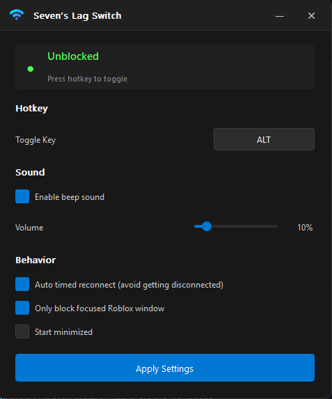

# Roblox Lag Switch

A simple and clean lag switch designed exclusively for Roblox.



## Features

- **Toggle Connection** – Block and unblock Roblox traffic with a single keypress.
- **Custom Hotkey** – Set any key as your toggle using the built-in key capture button.
- **Auto Timed Reconnect** – Automatically unblocks after 9 seconds to prevent disconnection.
- **Focus Only Mode** – Only blocks the Roblox window you're currently focused on.
- **Volume Control** – Adjustable beep volume with deeper, less harsh tones.
- **Modern UI** – Clean frameless dark theme with rounded corners and no clutter.
- **Auto-Apply Settings** – Changes save instantly, no restart required.

## Usage

1. Run the `.exe` as administrator.
2. Set your desired hotkey.
3. Press the hotkey while in Roblox to toggle your connection.
4. With auto timed reconnect enabled, traffic unblocks automatically at 9 seconds.

## Requirements

- Windows 10/11
- May require administrator privileges (sometimes required for firewall rules)

## Building from Source

```
pip install pyqt5 psutil pynput pywin32
python lag_switch.py
```

## Notes

- The lag switch works by creating temporary Windows Firewall rules to block Roblox traffic.
- All firewall rules are automatically cleaned up when the application closes.
- If focus only mode is enabled, the hotkey will only work when a Roblox window is in the foreground.
